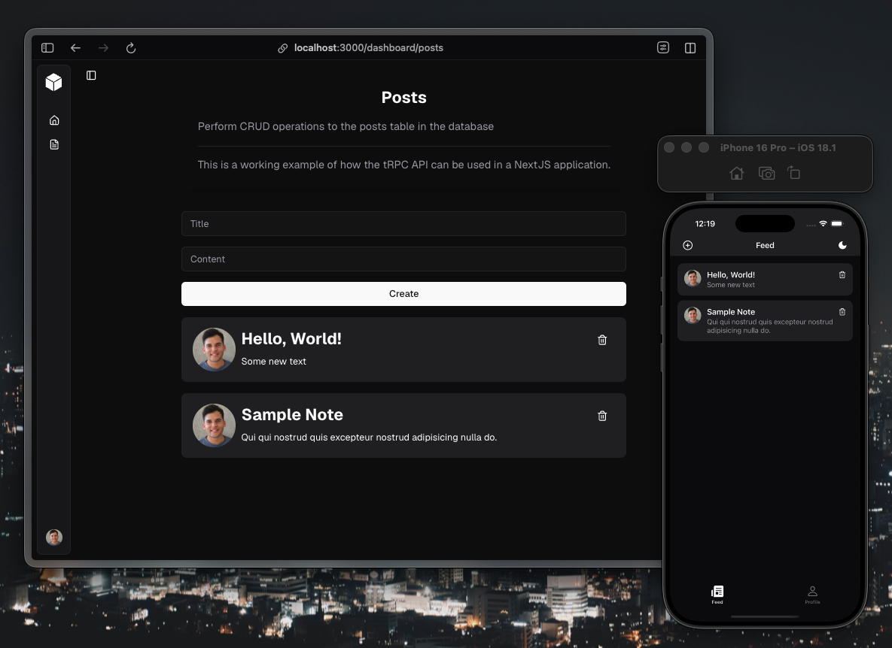

  

<h1 align="center">no-stack</h1>

A full-stack TypeScript monorepo template for building web and mobile applications with: Next.js + Expo + Supabase + tRPC

  
  
  
  
  
  
  
  
  
  

---

> Based on [create-t3-turbo](https://github.com/supabase-community/create-t3-turbo) by the Supabase community.

## Overview

A production-ready monorepo with shared code across web (Next.js) and mobile (Expo/React Native), backed by a type-safe API layer and PostgreSQL database.

### Apps

| App           | Description                                                             |
| ------------- | ----------------------------------------------------------------------- |
| `apps/nextjs` | Next.js 16 web app with React 19, Radix UI components, and Tailwind CSS |
| `apps/expo`   | Expo 54 mobile app with React Native, RN Primitives, and NativeWind     |

### Shared Packages

| Package               | Description                                                               |
| --------------------- | ------------------------------------------------------------------------- |
| `packages/api`        | tRPC server — type-safe API routes shared across web and mobile           |
| `packages/db`         | Drizzle ORM schema, migrations, and database client (Supabase/PostgreSQL) |
| `packages/files`      | File management utilities                                                 |
| `packages/validators` | Zod validation schemas shared across all apps                             |

### Tooling

| Package              | Description                           |
| -------------------- | ------------------------------------- |
| `tooling/eslint`     | Shared ESLint configuration           |
| `tooling/prettier`   | Shared Prettier configuration         |
| `tooling/tailwind`   | Shared Tailwind config (web + native) |
| `tooling/typescript` | Shared TypeScript configurations      |

## Key Libraries

- **UI (Web):** Radix UI primitives + shadcn pattern, Tailwind CSS, Framer Motion
- **UI (Mobile):** RN Primitives (Radix-compatible), NativeWind (Tailwind for RN), Reanimated
- **API:** tRPC 11 + TanStack React Query for end-to-end type safety
- **Database:** Drizzle ORM + Supabase (PostgreSQL)
- **Validation:** Zod across all layers
- **Forms:** React Hook Form + Zod resolvers
- **Auth:** Supabase Auth
- **Build:** Turborepo for task orchestration, pnpm workspaces

## Getting Started

1. Set up your local environment by following [LOCAL_SETUP.md](docs/setup/LOCAL_SETUP.md)
2. Run the applications by following [RUNNING_LOCALLY.md](docs/development/RUNNING_LOCALLY.md)

## Deployment & CI/CD

See [DEPLOYMENT.md](docs/setup/DEPLOYMENT.md) for GitHub Actions workflows, environment setup, and new project configuration.
