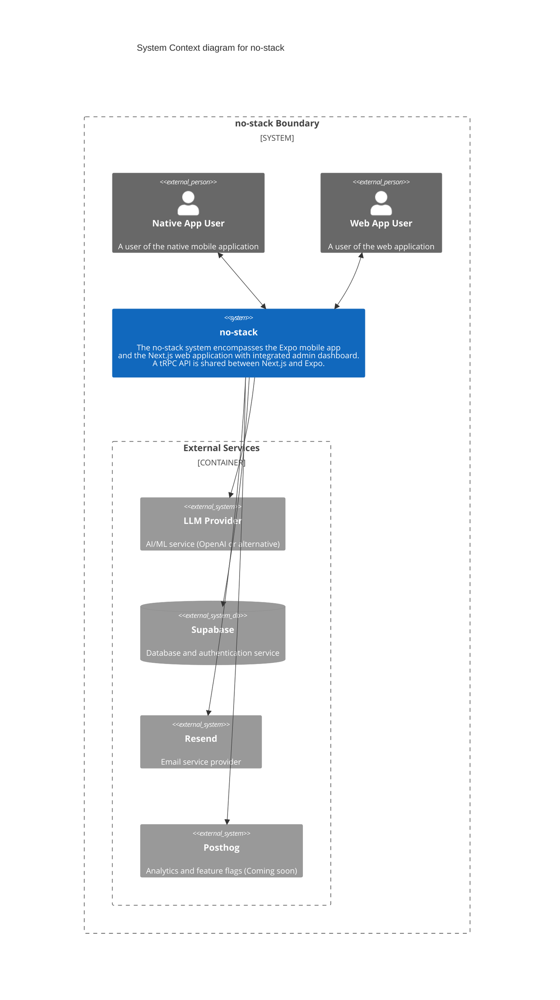
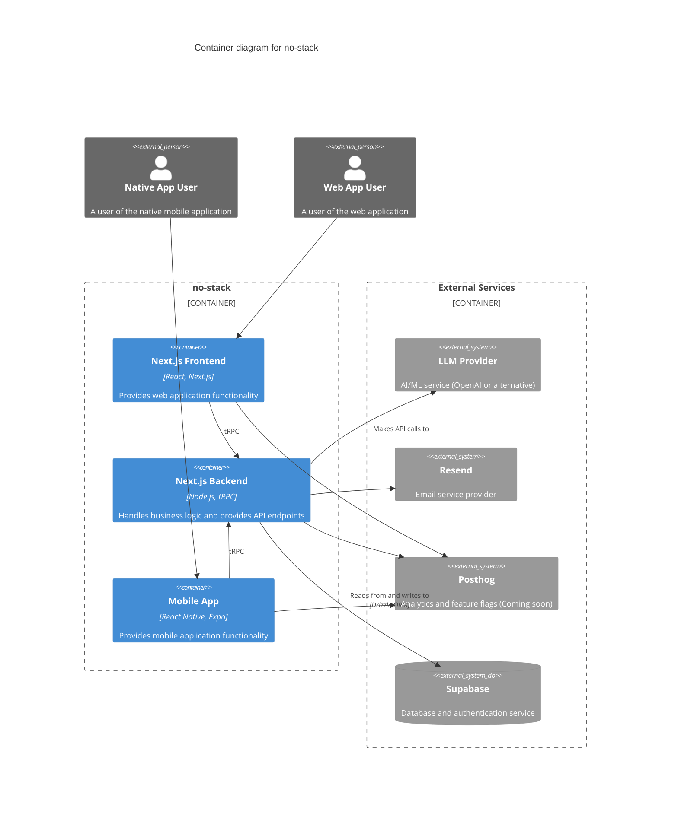

# C4 diagram

[Take me 🔙](../../README.md)

## C1: System Context Diagram

```mermaid
C4Context
    title System Context diagram for no-stack

    System_Boundary(b0, "no-stack Boundary") {
        Person_Ext(nativeUser, "Native App User", "A user of the native mobile application")
        Person_Ext(webUser, "Web App User", "A user of the web application")

        System(moStack, "no-stack", "The no-stack system encompasses the Expo mobile app<br/>and the Next.js web application with integrated admin dashboard.<br/>A tRPC API is shared between Next.js and Expo.")

        Container_Boundary(b1, "External Services") {
            System_Ext(llm, "LLM Provider", "AI/ML service (OpenAI or alternative)")
            SystemDb_Ext(supabase, "Supabase", "Database and authentication service")
            System_Ext(resend, "Resend", "Email service provider")
            System_Ext(posthog, "Posthog", "Analytics and feature flags (Coming soon)")
        }
    }

    BiRel(nativeUser, moStack, "")
    BiRel(webUser, moStack, "")

    Rel(moStack, supabase, "")
    Rel(moStack, resend, "")
    Rel(moStack, llm, "")
    Rel(moStack, posthog, "")

```

## C2: Container Diagram

```mermaid
C4Container
    title Container diagram for no-stack

    Person_Ext(nativeUser, "Native App User", "A user of the native mobile application")
    Person_Ext(webUser, "Web App User", "A user of the web application")

    Container_Boundary(mostack, "no-stack") {
        Container(nextFE, "Next.js Frontend", "React, Next.js", "Provides web application functionality")
        Container(nextBE, "Next.js Backend", "Node.js, tRPC", "Handles business logic and provides API endpoints")
        Container(expo, "Mobile App", "React Native, Expo", "Provides mobile application functionality")
    }

    Container_Boundary(external_services, "External Services") {
        System_Ext(llm, "LLM Provider", "AI/ML service (OpenAI or alternative)")
        System_Ext(resend, "Resend", "Email service provider")
        System_Ext(posthog, "Posthog", "Analytics and feature flags (Coming soon)")
        SystemDb_Ext(supabase, "Supabase", "Database and authentication service")
    }

    Rel(webUser, nextFE, "")
    Rel(nativeUser, expo, "")

    Rel(nextFE, nextBE, "tRPC")
    Rel(expo, nextBE, "tRPC")

    Rel(nextBE, supabase, "Reads from and writes to", "Drizzle ORM")
    Rel(nextBE, llm, "Makes API calls to")
    Rel(nextBE, resend, "")
    Rel(nextBE, posthog, "")
    Rel(nextFE, posthog, "")
    Rel(expo, posthog, "")
```
